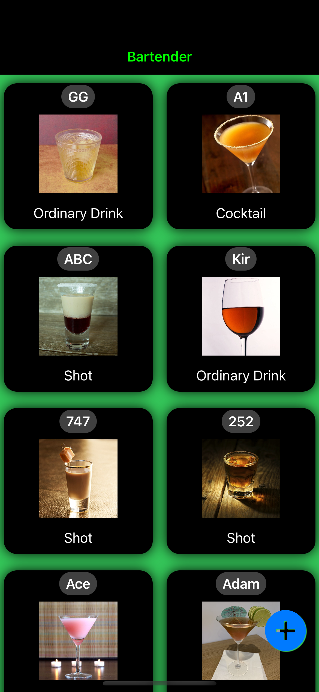
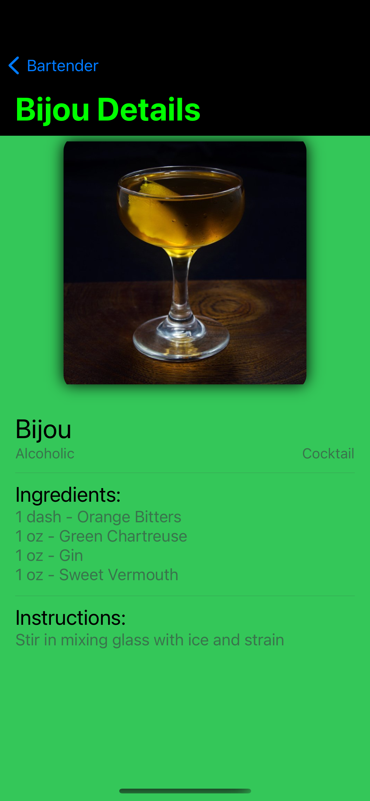
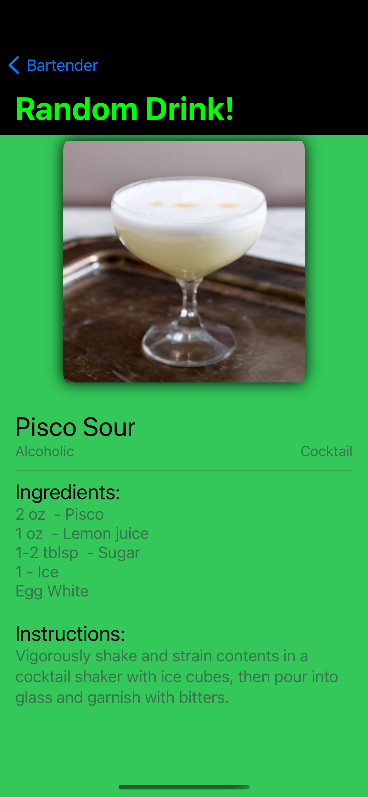

# Bartender MVVM App

## Overview
This application uses SwiftUI to display a list of drinks using MVVM architecture. It retrieves data from TheCocktailDB 
(https://www.thecocktaildb.com/api.php).  

## Dependencies  
**KingFisher:** Downloading/Displaying image urls  

## Screenshots

  
  
  

### Main Page
Displays a list of drinks. Click drinks to display drink details.  

### Drink Details Page
Displays drink name, image, instructions and ingredients.  

### Random Drink Page
Click a button to display a random drink!  

## Credits: Dave Nunez
Prof. Joshua Vandermost, Advanced IOS Development
